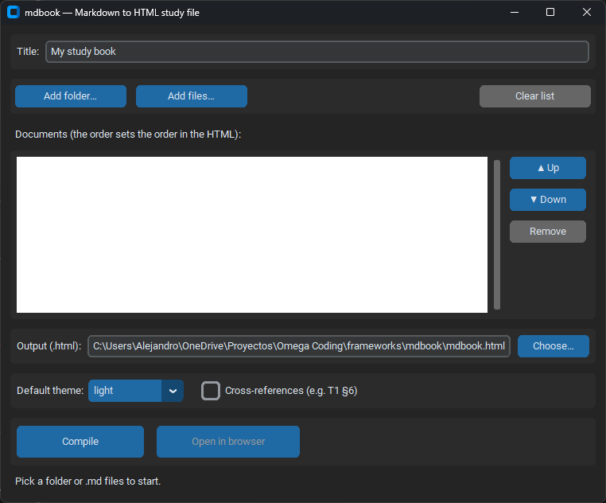
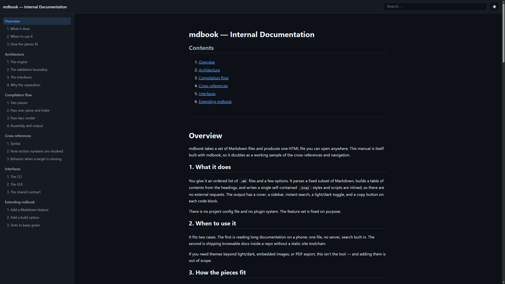

# mdbook

Compile several Markdown files into one self-contained HTML file: navigable,
searchable, with a light/dark theme and a copy button on every code block.

It exists for two things: reading docs comfortably on a phone, and shipping a
single browsable `.html` inside a repo. No server, no external dependencies in
the output.



## Features

- One or more `.md` files in a single HTML file. The first `#` of each file
  becomes its title in the navigation.
- Cover, table of contents and a sidebar with sections and subsections.
- Instant search that filters and highlights matches.
- Light/dark theme that remembers your choice.
- A "Copy" button on every code block, with its language label.
- Optional cross-references: `T1 §3` turns into an internal link.
- Self-contained output: CSS and JS are inlined, no external URLs.
- Two interfaces over one engine: a desktop app (CustomTkinter) and a CLI
  (Typer).

Supported Markdown: headings (`#`..`######`), paragraphs, nested lists, tables,
fenced code blocks with the language preserved, blockquotes (`>`), **bold**,
*italic* and `inline code`.

## Demo

[`examples/`](examples/) is a short guide to clean architecture — five linked
documents with numbered sections and cross-references between them. The compiled
result is in [`examples/demo.html`](examples/demo.html): download it and open it
in a browser.



To regenerate it:

```bash
uv run mdbook build --input examples --title "Clean Architecture — a short guide" \
  --theme dark --cross-refs --output examples/demo.html
```

## Using the app (no Python needed)

The desktop app is a single `mdbook.exe` — nothing to install, no Python. If
someone handed you the file, double-click it. To build it yourself, see
[Executable (.exe)](#executable-exe).

The first time you open it, Windows SmartScreen may say "Windows protected your
PC", because the binary isn't code-signed. Click **More info**, then **Run
anyway**.

Then:

1. **Add files…** or **Add folder…** to choose your `.md` files.
2. Reorder them with **Up**/**Down** — that order is the order in the output.
3. Type a **title**, pick a **theme**, and tick **cross-references** if your text
   uses the `T1 §3` syntax.
4. Click **Compile**, then **Open in browser**.

Prefer the terminal? There's a CLI for that — see [Usage](#usage).

## Install

Needs [uv](https://docs.astral.sh/uv/) and Python 3.12+.

```bash
git clone <repo-url>
cd mdbook
uv sync
```

## Usage

### Desktop app (GUI)

```bash
uv run mdbook-gui
```

Add a folder (all its `.md`) or individual files, reorder them with the Up/Down
buttons (the order is the order in the HTML), type a title, pick a theme,
optionally turn on cross-references, then Compile. "Open in browser" hands the
result to the system browser.

### Command line (CLI)

```bash
# A folder: takes every .md (alphabetical order)
uv run mdbook build --input docs --title "My Book" --theme dark --output book.html

# Individual files: the order of the -f flags is the order in the HTML
uv run mdbook build -f intro.md -f chap1.md -t "Course" --cross-refs -o course.html
```

| Option                           | Description                                       |
| -------------------------------- | ------------------------------------------------- |
| `--input/-i`                     | Folder: take every `.md` (alphabetical order).    |
| `--file/-f`                      | A single `.md` file (repeatable; sets the order). |
| `--title/-t`                     | Title of the work.                                |
| `--theme`                        | `light` or `dark` (default `light`).              |
| `--cross-refs / --no-cross-refs` | Turn cross-references on/off.                     |
| `--output/-o`                    | Output HTML path (`.html`).                       |

### Cross-references

With cross-references on, patterns like `T1 §3` become internal links:

- `T<n>` is document number `n` (1-based, in the order of the work).
- `§<m>` is the numbered section `m`: the heading whose text starts with `m.`
  (e.g. `## 3. Functions` is §3). Unnumbered subheadings don't count.

If the target doesn't exist, the text is left as is.

## Executable (.exe)

To produce a single desktop executable (Windows) with PyInstaller:

```bash
uv run pyinstaller packaging/mdbook.spec
```

The binary lands in `dist/mdbook.exe`: one window, no console, assets embedded.
It doesn't need Python installed to run.

## Documentation

[`docs/manual.html`](docs/manual.html) is the project's own documentation,
compiled with mdbook itself. The sources are the `docs/*.md` files. See
[docs/01-overview.md](docs/01-overview.md) to start.

## Architecture

The logic does not depend on the interface. That's the main design decision.

```
src/mdbook/
├── config.py        # Validation boundary: BuildOptions (Pydantic)
├── engine/          # Pure engine (imports no GUI, no CLI)
│   ├── parser.py    #   Markdown -> tokens (markdown-it-py) + sections
│   ├── model.py     #   internal model (Book, Document, Section)
│   ├── crossref.py  #   "T1 §3" references
│   ├── renderer.py  #   model -> self-contained HTML
│   ├── compiler.py  #   orchestration
│   └── assets/      #   template.html, style.css, app.js (inlined)
├── cli.py           # Interface: Typer + Rich
└── gui/app.py       # Interface: CustomTkinter
```

`config.py` is the single validation boundary: the GUI and the CLI both build
the same validated `BuildOptions` and hand it to the engine, which trusts it.
The engine runs and is tested without any interface.
[`tests/unit/test_architecture.py`](tests/unit/test_architecture.py) makes that
separation enforceable: it fails if the engine imports an interface or if the
GUI reaches into parsing or rendering.

## Development

```bash
uv run pytest            # all tests
uv run pytest -m unit    # markers: unit | smoke | regression
uv run ruff check .      # lint
uv run ruff format .     # format
uv run mypy              # types (strict)
```

Clone and work on the repo outside synced folders (OneDrive, Dropbox, Google
Drive). The sync client locks files under `.venv` and causes intermittent
failures when `uv` installs or reinstalls dependencies.

## License

[MIT](LICENSE) © 2026 Alejandro Segura.
